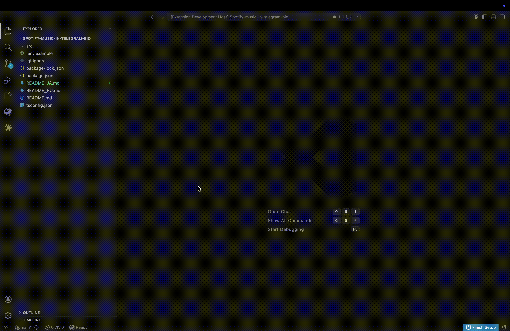

# GigaCommit - AI-Powered Git Commits for VSCode

[Русский](readme.md)

GigaCommit is a Visual Studio Code extension that leverages artificial intelligence to generate meaningful, conventional-style commit messages based on your code changes. 



## Features

✨ **AI-Powered Commit Messages** - Let GigaChat analyze your code changes and generate descriptive commit messages

🎯 **Conventional Commits** - All generated messages follow the Conventional Commits format for better project history

⚡ **Seamless Integration** - Works directly within VSCode's Git interface

🔐 **Secure** - Your code stays private; only diff information is sent to GigaChat API

⚙️ **Configurable** - Easy to configure OAuth credentials and endpoints

## Installation

1. Open VSCode
2. Go to Extensions view (Ctrl+Shift+X)
3. Search for "GigaCommit"
4. Click Install

## Configuration

Before using GigaCommit, you'll need to configure GigaChat OAuth credentials:

1. Open VSCode Settings (Ctrl+,)
2. Search for "GigaCommit"
3. Configure the following settings:

| Setting | Description | Default |
|---|---|---|
| `gigacommit.authorizationKey` | Base64-encoded authorization key (your API key for OAuth) | *required* |
| `gigacommit.scope` | OAuth scope — dropdown: PERS / B2B / CORP. API base URL is selected automatically from this value | `GIGACHAT_API_PERS` |
| `gigacommit.model` | GigaChat model — dropdown: GigaChat-2 / GigaChat-2-Pro / GigaChat-2-Max | `GigaChat-2` |
| `gigacommit.commitLanguage` | Language for the generated commit message text | `English` |
| `gigacommit.caBundlePath` | Path to a PEM file with custom CA certificates (optional) | *(empty)* |

### Getting the authorization key

1. Register your application in the [GigaChat developers portal](https://developers.sber.ru).
2. Go to **Settings** → **API Keys**.
3. Copy your **Authorization Key**.
4. Base64-encode it: `echo -n "key:value" | base64` (or use any online encoder).

The `authorizationKey` should look like `MDE5YWMx...` (a Base64 string).

### Which scope to use

| License type | `scope` | Selected automatically |
|---|---|---|
| Personal | `GIGACHAT_API_PERS` | `https://gigachat.devices.sberbank.ru/api/v1` |
| B2B | `GIGACHAT_API_B2B` | `https://api.giga.chat/v1` |
| Corporate | `GIGACHAT_API_CORP` | `https://api.giga.chat/v1` |

The extension selects the chat API base URL automatically:
- `GIGACHAT_API_PERS` -> `https://gigachat.devices.sberbank.ru/api/v1`
- `GIGACHAT_API_B2B` -> `https://api.giga.chat/v1`
- `GIGACHAT_API_CORP` -> `https://api.giga.chat/v1`

**Default:** `GIGACHAT_API_PERS`

### Available models

| Model | Price | Capabilities |
|---|---|---|
| `GigaChat-2` | Standard | Good for simple tasks, fastest responses |
| `GigaChat-2-Pro` | Moderate | Recommended — balanced speed and quality |
| `GigaChat-2-Max` | Highest | Most capable, best for complex reasoning |

The default is `GigaChat-2`: the base model with fast response times.

```json
{
  "gigacommit.authorizationKey": "your-base64-encoded-key-here",
  "gigacommit.scope": "GIGACHAT_API_PERS",
  "gigacommit.model": "GigaChat-2",
  "gigacommit.commitLanguage": "English"
}
```

### Commit language

The `gigacommit.commitLanguage` setting controls the language of the commit text:
- `English` — the summary and bullet points are generated in English
- `Russian` — the summary and bullet points are generated in Russian, using impersonal or passive phrasing

The Conventional Commit type stays standard:
- `feat: add commit language setting`
- `fix: исправлена обработка OAuth токена`

## Usage

1. Make your code changes
2. Stage the files you want to commit in the Git view
3. Open the Source Control view
4. Click the GigaCommit button in the Source Control header
5. Wait for GigaChat to generate a commit message
6. The generated message is inserted into the Source Control message field
7. Review it and press the normal Commit button yourself

## How It Works

1. The extension retrieves the **staged diff** (`git diff --cached`) via the VS Code Git extension API
2. It obtains an OAuth access token from Sber's token endpoint
3. It sends only the staged diff (unified diff format) to GigaChat API with instructions to generate a conventional commit message
4. GigaChat analyzes the changes and returns an appropriate commit message
5. The extension inserts the generated message into the Source Control input box
6. You review it and decide yourself whether to press `Commit`

Binary files in the staged changes are automatically excluded — Git marks them as `Binary files a/... and b/... differ`, so no raw binary data is ever sent to the API. If the diff exceeds ~20 KB, you'll be warned and can choose to truncate.

## Conventional Commits Format

GigaCommit ensures all generated messages follow the Conventional Commits specification:

```
<type>[optional scope]: <description>

[optional body]

[optional footer(s)]
```

For small diffs, GigaCommit aims to generate only the first summary line.

For larger diffs, it may add a short details section under the title, for example:

```text
feat: add SCM commit message generation

- update Source Control workflow in README
- add SCM action button integration
- insert generated message into commit input
```

Common types include:
- `feat`: A new feature
- `fix`: A bug fix
- `docs`: Documentation only changes
- `style`: Changes that do not affect the meaning of the code
- `refactor`: A code change that neither fixes a bug nor adds a feature
- `perf`: A code change that improves performance
- `test`: Adding missing tests or correcting existing tests
- `build`: Changes that affect the build system or external dependencies
- `ci`: Changes to CI configuration files and scripts
- `chore`: Other changes that don't modify src or test files

## Security

GigaCommit respects your code privacy:

- Only the diff of your staged changes is sent to the API
- Your full codebase remains on your machine
- OAuth token is cached in VS Code globalState (encrypted) and reused until 30 s before hard expiry
- If the server returns 401, the token is invalidated and refreshed automatically
- All communication with GigaChat uses HTTPS

## OAuth Flow

GigaCommit implements the official Sber GigaChat OAuth 2.0 flow:

1. **Token request** — sends `POST` to the auth endpoint with:
   - `Authorization: Basic <authorizationKey>`
   - `RqUID: <uuid4>` header
   - `scope=<your_scope>` body
2. **Chat completion** — uses the returned `access_token` as `Bearer` token

Token is cached across VS Code sessions and refreshed automatically. If the API returns 401, token is invalidated and re-obtained, with a single retry.

## Troubleshooting

**Q: I get an error about missing authorization key**
A: Make sure you've configured your `gigacommit.authorizationKey` in VSCode settings

**Q: HTTP 401 from token endpoint**
A: Verify the authorization key is correctly Base64-encoded and active in the GigaChat developer portal

**Q: The AI takes too long to respond**
A: Check your internet connection and GigaChat API status

**Q: Generated messages are not relevant**
A: Try staging fewer files at once for more focused commit messages

**Q: HTTP 403 Forbidden**
A: Verify the `scope` setting matches your license type (CORP / PERS / B2B)

### API Error Details

When the GigaChat API returns an error, the extension now shows the server-provided description — not just the HTTP status code.

| HTTP status | What it means | Common cause |
|---|---|---|
| 400 | Bad request — invalid parameters | Bad request body or unsupported model |
| 401 | Unauthorized — invalid/expired token | Token revoked or mismatched credentials |
| 403 | Forbidden — no access | Wrong `scope` or insufficient permissions |
| 404 | Not found | Wrong model name or endpoint mismatch for the selected scope |
| 422 | Unprocessable entity — invalid format | Malformed messages array |
| 429 | Rate limited | Too many requests — wait and retry |
| 500 | Internal server error | GigaChat backend issue |

The full response body is logged to the VS Code Developer Console for debugging, with sensitive data automatically redacted.

### TLS / Certificate Issues

Sber GigaChat API uses HTTPS with certificates issued by the Russian National CA (НУЦ Минцифры). If you see TLS handshake failures like `EPROTO`, `SSLV3_ALERT_HANDSHAKE_FAILURE`, or `CERT_UNTRUSTED`:

1. **Install the root certificate** — on most platforms, the "Russian Trusted Root CA" (НУЦ Минцифры) should be installed. On macOS it typically comes pre-installed. On Linux, add it to `/usr/local/share/ca-certificates/` and run `update-ca-certificates`.

2. **Corporate proxy / MITM** — if your company uses a proxy that intercepts HTTPS traffic, you may need to trust your proxy's CA certificate. Set the `GigaCommit: CA Bundle Path` setting to point to a PEM file containing your proxy's root certificate.

3. **Custom CA bundle** — if your system's default certificate store doesn't include the required CAs, you can provide a custom CA bundle:
   - Set `gigacommit.caBundlePath` to the full path of a `.pem` file
   - This file should contain the certificate chain (root CA + intermediates)
   - Example: `/path/to/nuts-minifry.pem`

   Do **not** disable TLS verification (`rejectUnauthorized: false`). The extension never disables TLS by default and strongly discourages it.

4. **Expired certificate** — if the server certificate has expired, check [GigaChat developer portal](https://developers.sber.ru) for any service notices.

## Contributing

Contributions are welcome! Please feel free to submit issues, feature requests, or pull requests.

## License

MIT License

## Acknowledgements

Powered by GigaChat AI and built on VSCode Extension APIs.
